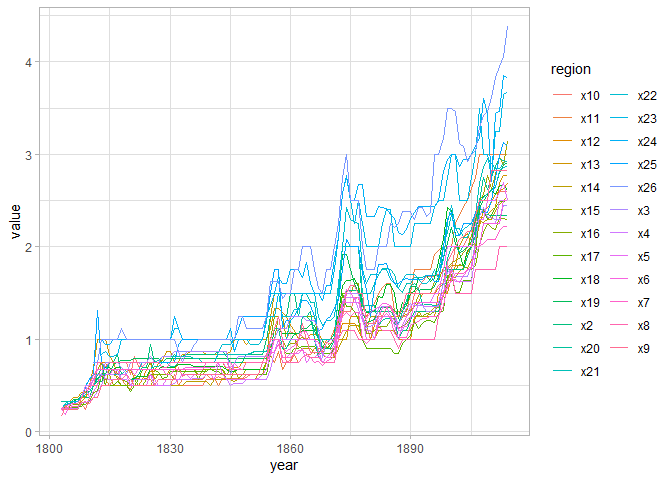
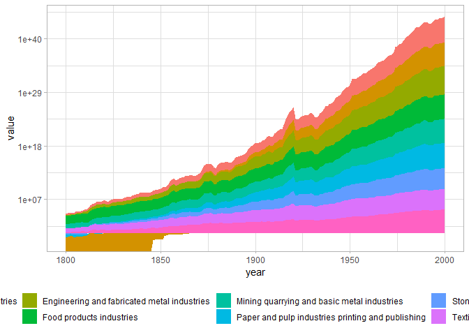
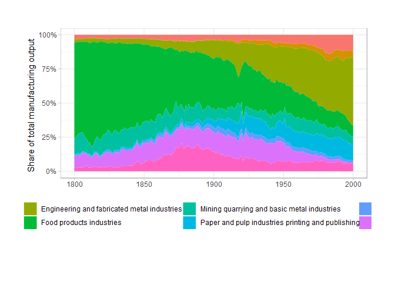
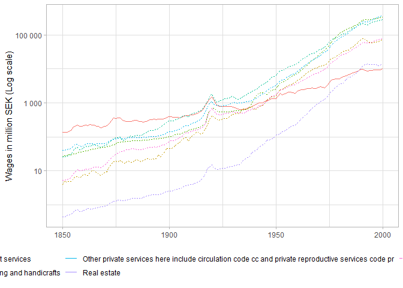
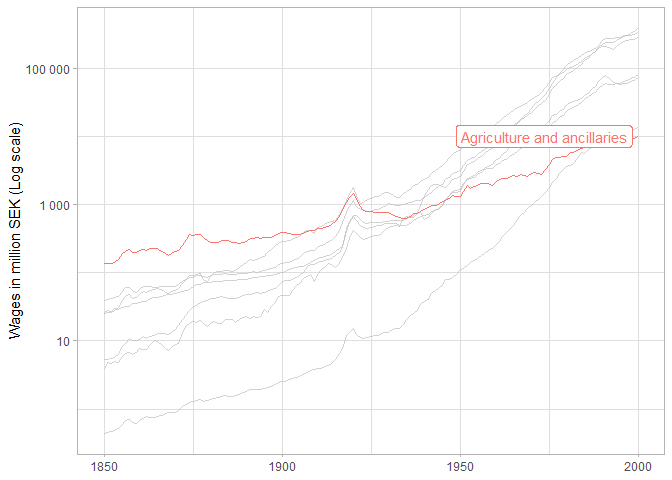

Swedish-day-wages
================
JJayes
06/09/2021

``` r
setwd("~/Recon/PhD-Ideas/Swedish day wages")
```

## Purpose

I want to have a look at the series of wages presented in the [Lund
University Macroeconomic and Demographic
Database](https://ekh.lu.se/en/research/economic-history-data/lu-madd/prices-and-wages)
in the section on prices an wages.

``` r
library(readxl)

df <- read_excel("data/day_wages_1803-1914__sek_.xls") %>% 
    janitor::clean_names()
```

    ## New names:
    ## * `` -> ...2
    ## * `` -> ...3
    ## * `` -> ...4
    ## * `` -> ...5
    ## * `` -> ...6
    ## * ...

``` r
# df %>% view()
```

The column names are silly - should fix them at some point.

``` r
df <- df %>% 
    filter(row_number() > 4)

df <- df %>% 
    mutate(across(where(is.character), parse_number))
```

    ## Warning: 3 parsing failures.
    ## row col expected                                                                                                  actual
    ## 115  -- a number Source: JÖRBERG, L. A History of Prices in Sweden 1732–1914. Part II. (CWK Gleerup. Lund, 1972) p. 588.
    ## 116  -- a number Lund University Macroeconomic and Demographic Database                                                 
    ## 117  -- a number http://www.ehl.lu.se/database/LU-MADD

``` r
df <- df %>% 
    pivot_longer(-day_wages, names_to = "region") %>% 
    rename(year = day_wages)
```

### Plotting

``` r
df %>% 
    ggplot(aes(year, value, colour = region)) +
    geom_line() 
```

    ## Warning: Removed 153 row(s) containing missing values (geom_path).

<!-- -->

### Industrial prices

``` r
df <- read_excel("data/nominal-gross-output-1800-2000.xlsx") %>% 
    janitor::clean_names()

df <- df %>% 
    pivot_longer(-type_of_activity, names_to = "manu_activity") %>% 
    rename(year = type_of_activity) %>% 
    mutate(manu_activity = str_to_sentence(str_replace_all(manu_activity, "_", " ")))

df %>% 
    filter(!str_detect(manu_activity, "Total")) %>% 
    ggplot(aes(year, value, fill = manu_activity)) +
    geom_area() +
    scale_y_log10() +
    theme(legend.position = "bottom")
```

    ## Warning: Transformation introduced infinite values in continuous y-axis

<!-- -->

``` r
library(ggiraph)
```

    ## Warning: package 'ggiraph' was built under R version 4.0.5

``` r
gg_industry <- df %>% 
    filter(!str_detect(manu_activity, "Total")) %>%
    # mutate(value_rounded = round(value, 2),
    #        text = glue("{manu_activity}\n{year}\nNominal output\n{value_rounded} m SEK")) %>% 
    ggplot(aes(year, value, fill = manu_activity,
               tooltip = manu_activity)) +
    geom_area_interactive(position = "fill") +
    # scale_y_log10() +
    theme(legend.position = "bottom") +
    scale_y_continuous(labels = percent_format(scale = 100)) +
    labs(x = NULL,
         y = "Share of total manufacturing output")

girafe(
  ggobj = gg_industry,
  width_svg = 6,
  height_svg = 6*0.618
)
```

<!-- -->

TODO: `gghighlight` line graph with the highlight on the activity hat is
clicked in the area plot.

Takeaway: wow look at how rapidly food products industries diminishes as
a share of total manufacturing production! It would be interesting to
look at how productivity increased in different areas of the country.
So, we have the data on industrial output over time, and the number of
factories in each area. We can link the census data based on who is
employed where and have a really gritty measure of productivity growth
per worker. We can answer - how did the increase in productivity affect
workers wages also.

There are maybe three forces that drive the decline in food output as a
share of total manufacturing output - a technology effect, a trade
effect and a price effect.

On the one hand, you have an uptake of new technologies that expand the
production frontier in the other industries that causes them to grow
massively so that in proportion, food products industries make up less
of the total value.

The trade effect would be a function of an increase in imports of
foodstuffs in light of exporting other manufactured goods. We have a
very interesting set of trade statistics, for example, [this selection
in a report on Shipping and Trade of 1890, published in
1891](http://share.scb.se/ov9993/data/historisk%20statistik/%C3%96vrig%20statistik%20fr%C3%A5n%20andra%20myndigheter%201877-%2FKonsulernas%20ber%C3%A4ttelser%20om%20handel%20och%20sj%C3%B6fart%201877-1893%2FKonsulernas-berattelser-handel-sjofart-1890-1800-talet.pdf).

Then on the other hand there are productivity advances in the food
manufacturing industry such that the price of food goes down as a share
of household expenditure - and consequently as a share of total
manufacturing output it will also go down. We have some amazing
statistics on the number of masters, journeyman and apprentices.

*På svenska är de: mästare, gesän och lärlingar*

These are by industry and region. Can you imagine!! It would be so fun
to build this series an show the different share of workers in each
industry in each region, and compare that to output by region and
industry.

Another interesting switch is from wood and wood products to pulp and
paper. It seems that there is a shift just after 1900 - the decline in
wood products as a share of total manufacturing output may be driven by
the increase in output of pulp and paper products.

List of items that are recorded in the [Contribution to Sweden’s
official statistics: Factories and
Manufacturies"](https://www.scb.se/hitta-statistik/sok/Index?Subject=allsubjects&Series=BISOS+D+Fabriker+och+manufakturer+1858-1910&From=1854&To=1910&Sort=relevance&Query=&Page=11&Tab=older&Exact=false):

Example from 1890:

-   

Wages of employees by activity from [Rodney
Edvinson](https://ekh.lu.se/en/research/economic-history-data/lu-madd/prices-and-wages)

The series shows “U. Wages and salaries (including social benefits) of
employees (current factor values, million SEK) of various types of
activities.”

``` r
df <- read_excel("data/wages-by-industry-clean.xlsx") %>% 
    janitor::clean_names()

df <- df %>% 
    pivot_longer(-year, names_to = "industry", values_to = "wages") %>% 
    mutate(industry = str_to_sentence(str_replace_all(industry, "_", " ")))

df %>% 
    filter(!str_detect(industry, "Total")) %>% 
    mutate(flag = ifelse(str_detect(industry, "Agriculture"), "Agriculture", "Other")) %>% 
    ggplot(aes(year, wages, lty = flag, colour = industry)) +
    geom_line() +
    theme(legend.position = "bottom") +
    scale_y_log10(labels = number_format()) +
    labs(x = NULL,
         y = "Wages in million SEK (Log scale)",
         colour = "Industry")
```

<!-- -->

Can use this to show how wages in Agriculture drop from being the
highest proportion of wages in the economy to the lowest in 2000.

``` r
library(gghighlight)
```

    ## Warning: package 'gghighlight' was built under R version 4.0.5

``` r
df %>% 
    filter(!str_detect(industry, "Total")) %>% 
    mutate(flag = ifelse(str_detect(industry, "Agriculture"), TRUE, FALSE)) %>% 
    ggplot(aes(year, wages, colour = industry)) +
    geom_line() +
    gghighlight(flag == TRUE) +
    theme(legend.position = "bottom") +
    scale_y_log10(labels = number_format()) +
    labs(x = NULL,
         y = "Wages in million SEK (Log scale)",
         colour = "Industry")
```

    ## Warning: Tried to calculate with group_by(), but the calculation failed.
    ## Falling back to ungrouped filter operation...

    ## label_key: industry

<!-- -->
